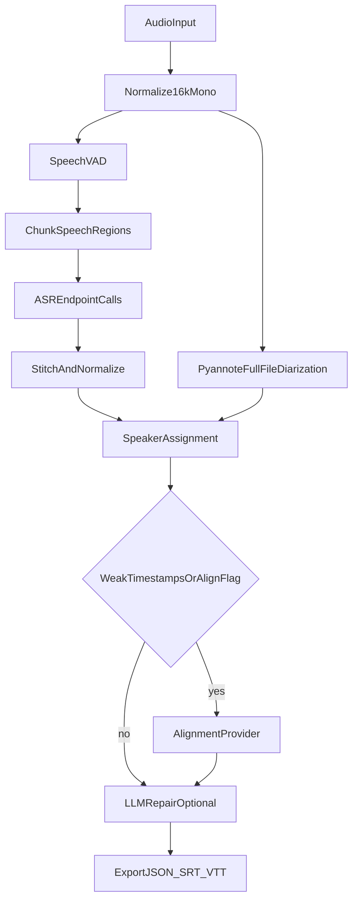

# resilient-stt — architecture & design decisions

Single source of truth for how this repository is structured, what it owns, and
what it deliberately does **not** own. Operational setup lives in
[README.md](../README.md); ASR worker contracts live in
[workers/README.md](../workers/README.md).

---

## 1. Problem & scope

**Goal:** Timestamped transcripts for **English, Hindi, and Hinglish** speech with
optional **speaker labels** and **LLM-based text repair**, without coupling the
orchestrator to any single ASR or alignment model.

**v1 delivery:** A **local, non-interactive CLI** (`python -m orchestrator.main`)
driven entirely by flags and environment variables. User-facing HTTP/API belongs
in **separate projects** that call `orchestrator.pipeline.run(JobConfig)`.

**Languages:** `hi`, `en`, and code-mixed **Hinglish** via ASR language hints
and repair prompts that preserve mixed script/style.

---

## 2. Core principle: split runtimes

```text
Orchestrator owns the voice pipeline.
ASR microservice owns model inference.
```

| Concern | Owner | Not in orchestrator |
|--------|--------|---------------------|
| ASR (Qwen, Whisper, Parakeet, hosted API) | External service | Model weights, vLLM, NeMo, faster-whisper |
| Chunking, VAD, stitching, exports | Orchestrator | — |
| Speaker diarization | Orchestrator (pyannote) | ASR backends |
| Transcript repair | Orchestrator (HTTP to LLM) | Repair model weights |
| Forced alignment (optional) | Pluggable provider | Mandatory per-backend aligner |

The orchestrator only needs: **endpoint URL**, **model name**, **audio path**,
**language hint**, optional **prompt**, and **response format**.

---

## 3. High-level pipeline



**Stage order** (see `orchestrator/pipeline.py`):

1. Normalize → `normalized.wav` (optional `--enhance-audio`: high-pass + denoise + loudnorm)
2. VAD → `speech_regions.json` `{regions, speech_onsets_samples}` (unless `--no-vad`)
3. Chunk for ASR only → `chunks/` + `chunks.json`
4. ASR per chunk → `asr_raw/<chunk_id>.json`
5. Stitch → global segments/words
6. Diarize on **full** normalized audio → `diarization.json` (unless `--skip-diarization`)
7. Assign speakers → `speaker_segments_raw.json`
8. Optional alignment (`--align` or weak ASR timestamps)
9. Optional repair (`--repair`) → `speaker_segments_repaired.json`
10. Export → `transcript.json`, `.srt`, `.vtt`

Every stage writes **debuggable artifacts** under `data/work/<job_id>/`.
`--resume` reuses existing files when present.

---

## 4. Repository layout

```text
resilient-stt/
  orchestrator/     # CLI, JobConfig, pipeline.run(), asr_discovery
  core/             # schemas, audio, vad, silero_vad, chunking, stitching, privacy
  asr/              # ASRProvider, endpoint client, probe, fallback_worker
  diarization/      # pyannote provider + speaker assignment
  alignment/        # AlignmentProvider ABC + NoOp + stubs
  repair/           # LLM repair, prompts, validation
  workers/          # ASR microservices (qwen-transformers implemented; others documented)
  scripts/          # optional ASR worker bootstrap helpers
  data/             # input / work / output directories
  tests/            # mocked unit tests (no live ffmpeg/pyannote/LLM)
  docs/             # this file
```

**Package name:** `resilient-stt` (PyPI-style); import paths are top-level modules
(`core`, `asr`, `orchestrator`, …) after editable install.

---

## 5. Key architectural decisions

### 5.1 External OpenAI-compatible ASR

- **Decision:** All ASR goes through `POST {base}/audio/transcriptions` with
  multipart fields matching the OpenAI audio API (`file`, `model`, `language`,
  `prompt`, `response_format`, `timestamp_granularities[]`).
- **Implementation:** `asr/endpoint_client.py` → `OpenAICompatibleASRProvider`.
- **Rationale:** Swap vLLM Qwen, hosted APIs, or custom Whisper/Parakeet
  wrappers without changing orchestrator code.
- **Abstraction:** `ASRProvider.transcribe(...) -> ASRResult`; router is a
  thin single-provider wrapper today (`asr/router.py`).
- **Discovery:** When no endpoint is configured, `orchestrator/asr_discovery.py`
  probes vLLM (`:8001`), then an existing qwen-asr worker (`:8002`), then may
  auto-start the local transformers worker via `asr/fallback_worker.py`.
  Orchestrator process still holds no ASR weights — inference runs in the worker subprocess.

### 5.2 Internal ASR schema with global timestamps

- **Decision:** Every ASR response is normalized to `ASRResult` in
  `core/schema.py` with **global** `start`/`end` (seconds from file start).
- **Rule:** `global_time = chunk.start_offset + local_time`.
- **Always retain** `raw_response` for debugging and backend-specific quirks.
- **Weak timestamps:** If ASR returns text only, one spanning segment is
  created and `weak_timestamps=True` gates optional alignment.

### 5.3 VAD before ASR (speech-only transcription)

- **Decision:** Default **VAD** (`core/vad.py`) with backend `auto`: **Silero**
  (Qwen toolkit default, `core/silero_vad.py`) → webrtcvad → RMS energy gate.
  **Silent audio is not sent to ASR.**
- **Artifact:** `speech_regions.json` stores merged `regions` plus
  `speech_onsets_samples` (Silero onsets feed pause-aligned chunking).
- **Rationale:** Long files with short speech must not produce hundreds of silent ASR calls.
- **Escape hatch:** `--no-vad` treats the full timeline as one region.
- **Diarization unchanged:** Still runs on the **full** `normalized.wav`.

### 5.4 Chunking owned by orchestrator

- **Decision:** Chunking applies **per speech region**, not per wall-clock file.
- **Modes** (`--chunk-mode`):
  - **`fixed` (default):** Region ≤ **10 min** → one ASR call; longer → **60 s**
    windows with **2 s** overlap.
  - **`pause-aligned`:** Qwen toolkit splits (~**120 s** targets snapped to speech
    onsets, **180 s** max per chunk; no overlap metadata).
- **Anti-pattern:** ASR services must **not** implement global chunking or
  cross-chunk timestamp stitching.

### 5.5 Stitching & overlap deduplication

- **Decision:** `core/stitching.py` merges chunk `ASRResult`s, deduping segments
  and words in overlap zones (±50 ms for words; confidence/length for segments).
- **Rationale:** Overlap exists only to avoid word boundary cuts; duplicates
  must not appear in the final transcript.

### 5.6 Full-file diarization (not per chunk)

- **Decision:** `pyannote.audio` runs once on `normalized.wav`.
- **Default model:**
  [`pyannote/speaker-diarization-community-1`](https://huggingface.co/pyannote/speaker-diarization-community-1)
  (not legacy 3.1).
- **Exclusive diarization:** Prefer `output.exclusive_speaker_diarization` when
  available — non-overlapping turns align better with ASR segment timestamps.
- **Anti-pattern:** Per-chunk diarization breaks speaker ID consistency.
- **Lazy import:** torch/pyannote load only when diarization runs; ASR-only
  installs skip the `diarization` extra.

### 5.7 Speaker assignment after ASR stitch

- **Decision:** `diarization/speaker_assignment.py` assigns speakers **after**
  ASR stitching.
- **Primary:** Per-word max IoU overlap with diarization turns.
- **Fallback:** Segment midpoint inside a turn; else `SPEAKER_UNKNOWN`.
- **Fields:** `raw_text` (ASR), `clean_text` (repair), `speaker`, timestamps
  immutable across repair.

### 5.8 Optional forced alignment

- **Decision:** `AlignmentProvider` ABC; default `NoOpAligner` (pass-through).
- **When:** `--align` **or** any chunk has `weak_timestamps`.
- **Stubs:** `QwenAligner`, `OptionalAligner` raise `NotImplementedError` in v1.
- **Rationale:** Alignment is model-specific; must not block the pipeline.

### 5.9 LLM repair: text only, validated

- **Decision:** Repair calls an OpenAI-compatible **`/chat/completions`** endpoint
  (`repair/llm_repair.py`), not embedded LLM weights.
- **Passes:**
  - Pass 1: windows of 20 segments, stride 18; accept center 18 updates only.
  - Pass 2: low-confidence segments only.
- **Invariant:** Repair may change **`text` only** — not `speaker`, `start`,
  `end`, or segment count (`repair/repair_validation.py`).
- **Status:** `repair_status` ∈ `raw | unchanged | corrected | failed`.

### 5.10 Configuration & execution model

- **Decision:** No interactive CLI (no menus/prompts). **argparse** + env vars +
  `.env` via `python-dotenv` on startup.
- **Secrets:** `ASR_API_KEY`, `REPAIR_*`, `HF_TOKEN` in `.env` (see
  `.env.example`); ASR URL/model remain CLI args for now.
- **Future:** HTTP microservice wraps `JobConfig` + `pipeline.run()`; same
  non-interactive contract.

### 5.11 Dependencies & platforms

| Extra | Packages | Notes |
|-------|-----------|--------|
| (core) | pydantic, httpx, numpy, soundfile, webrtcvad, python-dotenv | Always |
| `silero` | silero-vad, torch ≥ 2.8 | Qwen-aligned VAD; optional on core-only installs |
| `diarization` | pyannote.audio 4.x, torch ≥ 2.8 | pyannote 4 requires torch ≥ 2.8 |
| `full` | silero + diarization deps | Typical Apple Silicon / Linux setup |
| `dev` | pytest | |

- **Python:** `>=3.11,<3.13` (avoids uv resolving unsupported 3.14 splits).
- **Apple Silicon:** Native **arm64** venv; optional `--diarization-device mps`
  ([Metal PyTorch](https://developer.apple.com/metal/pytorch/)).
- **macOS Intel (x86_64):** Diarization extra **excluded** (no torch ≥ 2.8 wheels);
  use `--skip-diarization`.
- **uv:** `[tool.uv] environments` limits lock resolution to arm64-mac / Linux /
  Windows (see `pyproject.toml`).

### 5.12 Workers folder

- **Decision:** ASR runs out-of-process. `workers/qwen_transformers_service/`
  ships a CPU/MPS qwen-asr server; the orchestrator may auto-start it when no
  endpoint is reachable. vLLM, Whisper, and Parakeet wrappers remain documented
  placeholders — implement or deploy separately.
- **Rationale:** Keeps the orchestrator lean while allowing zero-config local runs
  without NVIDIA GPU.

---

## 6. Data contracts (summary)

### Chunk metadata (`ChunkMeta`)

Per ASR call: `chunk_id`, `audio_path`, global `start_offset` / `end_offset`,
overlap metadata, optional `region_id`.

### ASR result (`ASRResult`)

`provider`, `model`, `chunk_id`, `start_offset`, `language`, `text`, `segments[]`,
`words[]`, `weak_timestamps`, `raw_response`.

### Diarization turn (`DiarizationTurn`)

`speaker`, `start`, `end` (global seconds).

### Final segment (`TranscriptSegment`)

`speaker`, `start`, `end`, `raw_text`, `clean_text`, `words[]`, `asr_model`,
`asr_provider`, `confidence`, `repair_status`.

### Export document (`TranscriptDocument`)

`audio_file`, `duration`, `language`, `asr_provider`, `asr_model`, `segments[]`
→ JSON / SRT / VTT via `core/exporters.py`.

Full field definitions: `core/schema.py`.

---

## 7. Explicit non-goals & anti-patterns

Do **not**:

1. Embed ASR model weights in the orchestrator process.
2. Let the ASR microservice perform orchestrator-level chunking or global stitching.
3. Run diarization per ASR chunk.
4. Discard raw ASR JSON (`asr_raw/` must be kept).
5. Depend on one vendor-specific ASR JSON shape without normalization.
6. Allow LLM repair to alter timestamps, speakers, or segment boundaries.
7. Add interactive CLI flows (selections, wizards) — config is flags/env only.

---

## 8. Testing strategy

- **Unit tests** under `tests/`: pipeline happy path, VAD/chunking, pause-aligned
  splits, ASR discovery, repair validation, privacy, audio enhance — mocks and
  synthetic WAV only.
- **No live** ffmpeg, pyannote, or LLM in CI.
- **Entry point for API future:** test `pipeline.run(JobConfig, asr_provider=...)`
  with injected fakes.

---

## 9. Evolution path (not v1)

| Item | Direction |
|------|-----------|
| HTTP API | Thin FastAPI/GRPC layer over `pipeline.run(JobConfig)` |
| ASR workers | Extend `workers/*` (Whisper/Parakeet stubs remain) |
| Parallel chunk ASR | Concurrent httpx calls per chunk |
| Real aligners | Wire `QwenAligner` / WhisperX behind `AlignmentProvider` |
| Multi-endpoint ASR | Extend `asr/router.py` for routing by language/model |

---

## 10. Related documents

| Document | Purpose |
|----------|---------|
| [README.md](../README.md) | Install (uv), usage, env vars, artifacts |
| [.env.example](../.env.example) | Secret/template for local runs |
| [workers/README.md](../workers/README.md) | ASR microservice API contract |
| `orchestrator/pipeline.py` | Authoritative stage implementation |
| `core/schema.py` | Authoritative type definitions |
